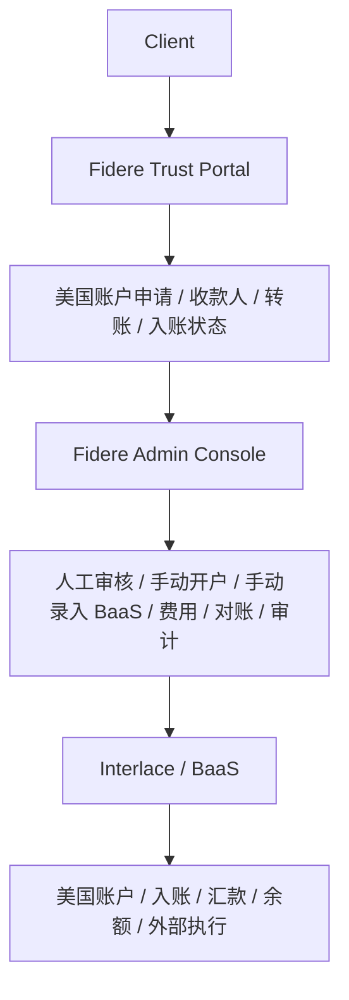
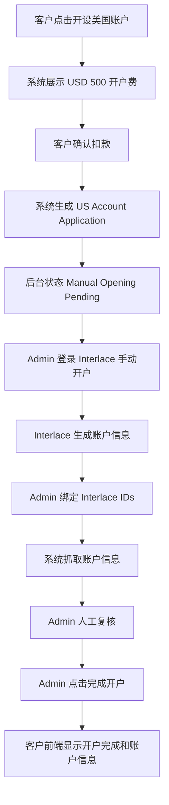
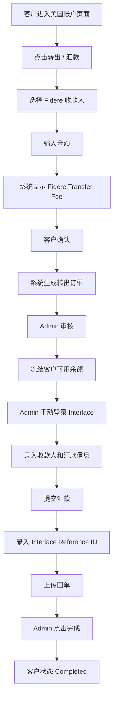
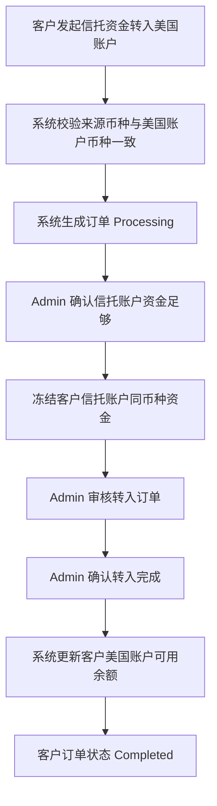
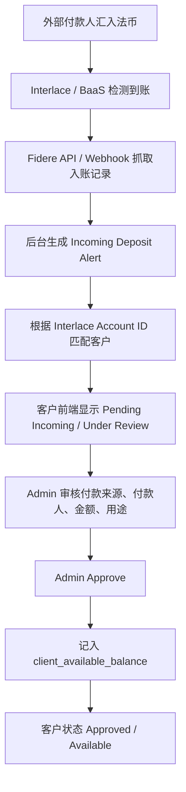

# Fidere Trust BaaS / Interlace 美国账户集成系统 PRD

Phase 1 / Phase 2 MVP Product Manual

版本：MVP Planning Draft  
适用范围：内部产品、技术、运营、合规、管理层  
系统边界：Client Portal + Admin Console  

## 目录

- [一、产品总览](#一产品总览)
- [二、核心业务原则](#二核心业务原则)
- [三、Phase 1 MVP 范围](#三phase-1-mvp-范围)
- [四、Phase 2 MVP 范围](#四phase-2-mvp-范围)
- [五、用户故事](#五用户故事)
- [六、美国账户开户流程](#六美国账户开户流程)
- [七、余额模型](#七余额模型)
- [八、转出流程](#八转出流程)
- [九、外部法币入账流程](#九外部法币入账流程)
- [十、收款人 / Beneficiary 模块](#十收款人--beneficiary-模块)
- [十一、客户端页面规划](#十一客户端页面规划)
- [十二、Admin 后台页面规划](#十二admin-后台页面规划)
- [十三、数据库表设计建议](#十三数据库表设计建议)
- [十四、状态机](#十四状态机)
- [十五、客户端与后台可见范围](#十五客户端与后台可见范围)
- [十六、费用逻辑](#十六费用逻辑)
- [十七、API / Webhook 设计](#十七api--webhook-设计)
- [十八、审计日志](#十八审计日志)
- [十九、一期不做清单](#十九一期不做清单)
- [二十、给 Cursor / Codex 的开发任务拆分](#二十给-cursor--codex-的开发任务拆分)

## 一、产品总览

Fidere Trust 系统不是把 Interlace / BaaS 的真实账户余额和原始交易记录直接展示给客户的镜像系统。

本系统应定位为：

> Fidere Trust 系统 = 客户关系 + 信托账户 + 美国账户展示层 + 指令系统 + 费用系统 + 审核系统 + 内部执行台账

Interlace / BaaS 的定位是：

> Interlace / BaaS = 底层美国账户开立、收款、汇款、余额、交易执行工具

客户看到的是 Fidere Trust 提供的美国账户服务、信托账户记录、Fidere 计算后的可用余额和订单状态。Admin 后台看到的是 Interlace 实际账户、实际余额、实际交易、实际手续费、内部 funding、OTC、成本、利润和审计留痕。

### 系统关系



## 二、核心业务原则

| 原则 | 说明 |
| --- | --- |
| 客户前台只展示 Fidere 计算后的余额 | 客户看到 `client_available_balance`，不是 `interlace_actual_balance`。 |
| Interlace actual balance 仅供后台使用 | 用于对账、真实资金确认、出款可行性判断和成本核算。 |
| BaaS USDT 地址仅为内部执行地址 | 标记为 `INTERNAL_EXECUTION_ONLY`，不得展示给客户。 |
| 客户不能充值 USDT | 不做客户钱包，不做链上充值，不展示链上流水。 |
| 客户必须从 Fidere 系统选择收款人 | 客户维护的是 Fidere Beneficiary，不直接操作 BaaS Payee。 |
| Phase 1 采用半自动人工执行 | Interlace 开户、BaaS payee、payout、USDT funding、OTC 均由 Admin 人工执行或确认。 |
| 外部法币入账先审核后可用 | 入账可先显示 Under Review，通过 Admin 审核后才进入可用余额。 |
| Fidere 可自定义客户手续费 | Interlace fee、OTC cost、bank cost、margin 只在后台可见。 |
| 所有关键操作必须审计留痕 | Admin 拥有后台处理权限，但任何敏感操作必须记录 `audit_logs`。 |

## 三、Phase 1 MVP 范围

### 一期目标

客户可以在 Fidere 系统内申请美国账户、支付 USD 500 开户费、查看开户状态。Admin 在 Interlace / BaaS 手动开户并绑定账户。客户可查看经 Fidere 复核后的美国账户信息和 Fidere 计算后的可用余额。客户可选择 Fidere 系统内的收款人发起转出。Admin 手动在 Interlace / BaaS 录入和执行。外部法币入账先显示审核中，Admin 审核后才计入客户可用余额。

### P0 必做

- 美国账户申请。
- USD 500 开户费扣款。
- Admin 手动 Interlace 开户记录。
- Interlace Account ID / Customer ID / Virtual Account ID 绑定。
- Interlace 账户信息抓取。
- Admin 人工复核账户信息。
- 客户查看美国账户信息。
- 客户可见余额模型。
- 收款人管理。
- 客户选择收款人发起转出。
- Admin Manual BaaS Entry Console。
- BaaS Reference ID / 回单上传。
- 外部法币入账抓取。
- 入账审核后计入客户余额。
- 基础费用记录。
- 基础审计日志。

### P1 可做

- 基础利润计算。
- Interlace actual balance vs client_available_balance 差异表。
- 基础对账。
- 双人复核字段预留。
- 入账通知。
- 订单筛选和导出。

## 四、Phase 2 MVP 范围

### 二期目标

在一期半自动模式基础上，增加自动同步、自动匹配、费用引擎、对账、报表、客户 statement 和异常处理能力。

### 二期可做

- 自动调用 Interlace 开户接口。
- 自动同步账户信息。
- 自动同步余额。
- 自动匹配外部入账。
- 自动创建 BaaS Payee。
- 自动创建 Payout。
- Webhook 自动更新状态。
- Fee Engine 配置化。
- 自动对账。
- 客户月结单。
- 利润报表。
- 异常处理中心。
- 权限增强和字段级脱敏。
- 多通道准备。

### 二期仍然保持

- 客户前台只看 Fidere `client_available_balance`。
- 客户不看 Interlace actual balance。
- 客户不看 Interlace 成本。
- 客户不看 USDT funding。
- 客户不看 OTC 成本。
- 客户不看 Fidere margin。

## 五、用户故事

### User Story 1：客户申请美国账户

客户在 Fidere Trust 系统内选择“开设美国账户”，系统提示开户费 USD 500。客户确认后，系统从客户信托账户扣除 USD 500，并生成开户申请。Admin 收到请求后，在 Interlace / BaaS 系统中手动为客户开户。账户开立完成后，Admin 在 Fidere 后台通过 Interlace Account ID、Customer ID、Virtual Account ID 等信息进行绑定。Interlace 返回账户信息后，Admin 人工复核，确认无误后点击完成开户。客户开户状态变为 Completed，并可以看到美国账户信息和 Fidere 计算后的余额。

### User Story 2：客户从美国账户已有余额转出

客户的 Interlace / BaaS 美国账户中已有实际余额。客户在 Fidere 系统中选择收款人，输入转账金额，确认 Fidere 自定义手续费后提交转账指令。Admin 审核收款人、用途和文件后，手动登录 Interlace / BaaS，将收款人和转账信息录入并发起汇款。完成后，Admin 在 Fidere 后台录入 BaaS Reference ID、上传回单并点击完成。客户看到的是从 Fidere 美国账户汇出，费用为本金 + Fidere 打款手续费。

### User Story 3：客户从信托账户资金调拨到美国账户后转出

客户在 Fidere 信托账户中有法币资金，但美国 BaaS 账户实际没有余额。客户在 Fidere 系统中发起从美国账户转出或从信托账户转入美国账户。系统生成订单并显示 Processing。Admin 确认客户信托账户资金足够后，Fidere 从内部钱包转 USDT 到该客户名下的 BaaS 地址，完成 OTC 后，通过 BaaS 手动法币汇出。客户只看到订单 Processing / Completed，不看到 USDT、OTC、BaaS 地址或链上记录。

### User Story 4：外部法币转入美国账户

外部付款人向客户美国账户汇入法币。Interlace / BaaS 通过 API 或 webhook 返回入账记录。Fidere 后台收到提示后，系统匹配客户和美国账户。客户前端可以看到该笔入账状态为 Under Review / 审核中。Admin 审核付款来源、付款人、金额和用途。审核通过后，该笔资金进入 `client_available_balance`，客户状态变为 Approved / 已审核。

### User Story 5：客户管理收款人

客户在 Fidere 系统内新增或选择收款人。收款人作为 Fidere Beneficiary 主数据存在。客户发起转账时，只能选择 Fidere 系统内的收款人。BaaS Payee 是内部执行数据，仅由 Admin 在 BaaS 后台手动创建或选择，不客户可见。

## 六、美国账户开户流程

### 流程步骤



### 客户可见开户状态

| 状态 | 说明 |
| --- | --- |
| Not Applied | 客户尚未申请美国账户。 |
| Opening Fee Pending | 开户费待确认或待扣款。 |
| Application Submitted | 申请已提交。 |
| Processing | 开户处理中。 |
| Account Ready for Review | 账户信息待后台复核。 |
| Completed | 开户完成，客户可查看账户信息。 |
| Rejected | 申请已拒绝。 |

### 后台开户状态

| 状态 | 说明 |
| --- | --- |
| REQUEST_SUBMITTED | 开户请求已提交。 |
| OPENING_FEE_DEDUCTED | 开户费已扣除。 |
| MANUAL_OPENING_PENDING | 等待 Admin 手动在 Interlace 开户。 |
| INTERLACE_ACCOUNT_CREATED | Interlace 账户已创建。 |
| ACCOUNT_INFO_SYNCED | 账户信息已同步。 |
| ACCOUNT_INFO_REVIEW_PENDING | 账户信息待复核。 |
| ACCOUNT_INFO_CONFIRMED | 账户信息已确认。 |
| COMPLETED | 开户流程完成。 |
| FAILED | 开户失败。 |

## 七、余额模型

客户前端不得直接展示 Interlace actual balance。客户看到的余额必须是 Fidere 根据信托台账、费用、冻结、审核和可用金额规则计算后的 `client_available_balance`。

### 余额类型

| 余额字段 | 可见范围 | 说明 |
| --- | --- | --- |
| `interlace_actual_balance` | Admin only | Interlace / BaaS 返回的真实底层余额，用于对账、确认真实资金、确认是否可出款。 |
| `client_available_balance` | Client + Admin | 客户前端可见余额，由 Fidere 计算。 |
| `pending_incoming_balance` | Client + Admin | 外部法币入账已检测，但尚未通过 Fidere 审核。 |
| `pending_transfer_in_balance` | Client + Admin | 客户从信托账户转入美国账户或资金调拨处理中。 |
| `processing_outgoing_balance` | Client + Admin | 客户已发起转出，订单处理中。 |
| `frozen_balance` | Admin only，可按业务决定是否部分提示客户 | 因审核、转账、风控或异常处理临时冻结的金额。 |
| `ledger_balance` | Admin only | Fidere 内部信托台账余额。 |
| `difference_amount` | Admin only | Interlace actual balance 与 Fidere 台账 / 客户余额之间的差异。 |
| `difference_reason` | Admin only | 差异解释。 |

### 可用余额公式

```text
client_available_balance =
  approved_incoming
  + approved_internal_transfer_in
  - completed_outgoing
  - processing_frozen_amount
  - fidere_fees
  +/- manual_adjustments
```

### 差异原则

`Interlace Actual Balance != Client Available Balance` 是允许的，但差异必须能在后台解释。

常见差异原因：

- Fidere fees。
- Pending review。
- Frozen amount。
- Internal transfer。
- Manual adjustment。
- Interlace pending transaction。
- Interlace fee。
- OTC / funding timing difference。

### 客户前端展示建议

- Available Balance。
- Pending Incoming。
- Processing Outgoing。
- Pending Transfer In。

### Admin 后台展示建议

- Interlace Actual Balance。
- Fidere Client Available Balance。
- Ledger Balance。
- Difference。
- Difference Reason。

## 八、转出流程

### Source A：US_ACCOUNT_ACTUAL_BALANCE

适用场景：客户美国 BaaS 账户内已有实际余额。



客户看到：

- 汇款本金。
- Fidere 打款手续费。
- 总扣款。
- 状态。
- 回单。

客户不看到：

- Interlace 固定手续费。
- Interlace 成本。
- Interlace 实际余额。
- Fidere 毛利。

### Source B：TRUST_ACCOUNT_TO_US_ACCOUNT

适用场景：客户信托账户已有与美国账户相同币种的法币资金，客户希望将该笔资金转入美国账户余额展示或用于后续同币种汇款。该流程只支持同币种转入，不涉及换汇、数字货币兑换、USDT funding 或 OTC。



客户不看到：

- 后台审核备注。
- 内部账务校验记录。
- Interlace 实际余额。
- Interlace 成本。

规则：

- 来源信托账户币种、目标美国账户币种、转入订单币种必须一致。
- 币种不一致时，订单不得进入审核完成流程，应直接失败或退回修改。
- 不得以 OTC、换汇、数字货币兑换或链上 funding 作为该流程的主执行方式。

## 九、外部法币入账流程



### 入账状态

| 状态 | 说明 |
| --- | --- |
| DETECTED | Interlace / BaaS 检测到入账。 |
| MATCHED | 系统已匹配客户和美国账户。 |
| UNDER_REVIEW | 入账待 Admin 审核。 |
| APPROVED | 入账审核通过。 |
| REJECTED | 入账审核拒绝。 |
| POSTED_TO_CLIENT_BALANCE | 已记入客户可用余额。 |

### 外部入账与内部 funding 的边界

| 类型 | 客户是否可见 | 是否进入客户可用余额 | 说明 |
| --- | --- | --- | --- |
| 外部法币入账 | 可见，先显示 Under Review | 审核通过后进入 | 客户美国账户收到外部法币汇款。 |
| Internal USDT Funding | 不可见 | 不进入 | 仅用于 Fidere 内部执行、OTC 和法币汇出。 |

## 十、收款人 / Beneficiary 模块

### 客户功能

- 新增收款人。
- 选择收款人。
- 查看收款人。
- 编辑收款人。
- 停用收款人。

### Admin 功能

- 审核收款人。
- 标记风险等级。
- 记录是否已手动录入 Interlace。
- 记录 BaaS Payee ID。
- 查看收款人相关转账记录。

### 数据边界

| 概念 | 可见范围 | 说明 |
| --- | --- | --- |
| Fidere Beneficiary | Client + Admin | 客户可见，客户在 Fidere 系统内维护和选择。 |
| BaaS Payee | Admin only | 客户不可见，仅供 Admin 在 BaaS 系统内手动创建或选择。 |
| Trust Instruction / Transfer Order | Client + Admin | 客户基于 Fidere Beneficiary 提交的转账指令。 |
| Manual BaaS Entry | Admin only | Admin 将指令手动录入 BaaS 后形成的内部执行记录。 |

## 十一、客户端页面规划

| 页面 | 主要内容 |
| --- | --- |
| 美国账户首页 | 开户状态、美国账户信息、可用余额、待审核入账、处理中转出、转入处理中、最近交易。 |
| 申请美国账户页面 | 服务说明、开户费 USD 500、确认扣款、申请状态。 |
| 收款人管理页面 | 新增收款人、收款人列表、银行账户信息、状态。 |
| 发起转账页面 | 选择美国账户、选择收款人、输入金额、选择币种、显示 Fidere 手续费、显示总扣款、确认提交。 |
| 入账记录页面 | 入账金额、付款人、日期、状态：审核中 / 已审核 / 已拒绝。 |
| 交易详情页面 | 订单编号、金额、收款人、手续费、状态、回单、时间线。 |

## 十二、Admin 后台页面规划

所有后台页面统一归入 Admin Console，不按不同部门拆分。

| 页面 | 主要内容 |
| --- | --- |
| Admin - 美国账户开户管理 | 开户申请列表、开户费扣款状态、Interlace 开户状态、手动绑定 Interlace ID、账户信息同步、人工复核、完成开户。 |
| Admin - 美国账户详情 | Interlace Actual Balance、Fidere Client Available Balance、Pending Incoming、Frozen Amount、Processing Outgoing、Difference、Difference Reason。 |
| Admin - 外部入账审核 | Interlace 入账提醒、客户匹配、付款人信息、金额、用途、审核通过 / 拒绝、入账到客户可用余额。 |
| Admin - 转出订单管理 | 客户、美国账户、收款人、金额、Fidere 手续费、Interlace 手续费、转出来源类型、状态、审核、执行、完成。 |
| Admin - Manual BaaS Entry Console | 客户选择的收款人信息、银行账户信息、付款金额、用途、支持文件、复制到 BaaS 的字段、BaaS Payee ID、BaaS Payout ID、BaaS Reference ID、回单上传、双人复核字段预留。 |
| Admin - Internal Funding / OTC Console | 客户信托资金、USDT funding、tx hash、OTC rate、法币到账、成本、利润、执行凭证。 |
| Admin - Fee & Profit Console | Fidere 收取费用、Interlace 成本、OTC 成本、银行成本、毛利、对账状态。 |
| Admin - Audit Log | 操作人、操作时间、操作对象、操作前、操作后、IP / device 信息，如现有系统支持。 |

## 十三、数据库表设计建议

以下为建议新增表 / 字段，用于后续实现阶段评审，不代表本 PRD 文档已修改真实数据结构。

### `us_account_applications`

| 字段 | 说明 |
| --- | --- |
| `id` | 主键。 |
| `client_id` | 客户 ID。 |
| `trust_id` | 信托 ID。 |
| `application_status` | 开户申请状态。 |
| `opening_fee_amount` | 开户费金额，默认 USD 500。 |
| `opening_fee_currency` | 开户费币种。 |
| `opening_fee_ledger_entry_id` | 开户费台账记录 ID。 |
| `requested_at` | 客户申请时间。 |
| `processed_by` | Admin 处理人。 |
| `processed_at` | Admin 处理时间。 |
| `completed_at` | 开户完成时间。 |
| `notes` | 备注。 |

### `us_accounts`

| 字段 | 说明 |
| --- | --- |
| `id` | 主键。 |
| `client_id` | 客户 ID。 |
| `trust_id` | 信托 ID。 |
| `provider` | 账户服务商，例如 Interlace。 |
| `interlace_customer_id` | Interlace 客户 ID。 |
| `interlace_account_id` | Interlace 账户 ID。 |
| `interlace_virtual_account_id` | Interlace 虚拟账户 ID。 |
| `account_holder_name` | 账户名称。 |
| `bank_name` | 银行名称。 |
| `bank_address` | 银行地址。 |
| `account_number` | 账户号码。 |
| `routing_number` | Routing Number / ABA。 |
| `swift_bic` | SWIFT / BIC。 |
| `currency` | 币种。 |
| `account_status` | 账户状态。 |
| `client_visible` | 是否客户可见。 |
| `info_confirmed_by` | 账户信息确认人。 |
| `info_confirmed_at` | 账户信息确认时间。 |
| `created_at` | 创建时间。 |
| `updated_at` | 更新时间。 |

### `account_balances`

| 字段 | 说明 |
| --- | --- |
| `id` | 主键。 |
| `us_account_id` | 美国账户 ID。 |
| `currency` | 币种。 |
| `interlace_actual_balance` | Interlace 实际余额，Admin only。 |
| `client_available_balance` | 客户可用余额。 |
| `pending_incoming_balance` | 待审核入账金额。 |
| `pending_transfer_in_balance` | 转入处理中金额。 |
| `processing_outgoing_balance` | 出款处理中金额。 |
| `frozen_balance` | 冻结金额。 |
| `ledger_balance` | 内部台账余额。 |
| `difference_amount` | 差异金额。 |
| `difference_reason` | 差异原因。 |
| `updated_at` | 更新时间。 |

### `beneficiaries`

| 字段 | 说明 |
| --- | --- |
| `id` | 主键。 |
| `client_id` | 客户 ID。 |
| `trust_id` | 信托 ID。 |
| `beneficiary_type` | 收款人类型。 |
| `name` | 收款人名称。 |
| `country` | 国家或地区。 |
| `relationship_to_client` | 与客户关系。 |
| `default_purpose` | 默认付款用途。 |
| `status` | 收款人状态。 |
| `risk_level` | 风险等级。 |
| `reviewed_by` | 审核人。 |
| `reviewed_at` | 审核时间。 |
| `created_at` | 创建时间。 |

### `beneficiary_bank_accounts`

| 字段 | 说明 |
| --- | --- |
| `id` | 主键。 |
| `beneficiary_id` | 收款人 ID。 |
| `account_name` | 银行账户名。 |
| `bank_name` | 银行名称。 |
| `bank_country` | 银行国家。 |
| `bank_address` | 银行地址。 |
| `account_number` | 银行账号。 |
| `swift_bic` | SWIFT / BIC。 |
| `iban` | IBAN。 |
| `routing_number` | Routing Number。 |
| `currency` | 币种。 |
| `status` | 状态。 |
| `created_at` | 创建时间。 |

### `us_account_transfers`

| 字段 | 说明 |
| --- | --- |
| `id` | 主键。 |
| `client_id` | 客户 ID。 |
| `trust_id` | 信托 ID。 |
| `us_account_id` | 美国账户 ID。 |
| `beneficiary_id` | 收款人 ID。 |
| `beneficiary_bank_account_id` | 收款人银行账户 ID。 |
| `transfer_source_type` | 转出来源类型。 |
| `payout_currency` | 出款币种。 |
| `payout_amount` | 出款本金。 |
| `fidere_fee_amount` | Fidere 客户手续费。 |
| `fidere_fee_currency` | Fidere 手续费币种。 |
| `interlace_fee_amount` | Interlace 成本，Admin only。 |
| `total_client_deduction` | 客户总扣款。 |
| `status` | 订单状态。 |
| `client_confirmed_at` | 客户确认时间。 |
| `reviewed_by` | Admin 审核人。 |
| `reviewed_at` | 审核时间。 |
| `completed_at` | 完成时间。 |
| `created_at` | 创建时间。 |

`transfer_source_type`:

- `US_ACCOUNT_ACTUAL_BALANCE`
- `TRUST_ACCOUNT_TO_US_ACCOUNT`

### `baas_manual_entries`

| 字段 | 说明 |
| --- | --- |
| `id` | 主键。 |
| `transfer_id` | 转账订单 ID。 |
| `provider` | 服务商。 |
| `interlace_account_id` | Interlace 账户 ID。 |
| `interlace_payee_id` | Interlace Payee ID。 |
| `interlace_payout_id` | Interlace Payout ID。 |
| `interlace_reference_id` | Interlace Reference ID。 |
| `entered_by` | 录入人。 |
| `entered_at` | 录入时间。 |
| `checked_by` | 复核人，Phase 1 可预留。 |
| `checked_at` | 复核时间，Phase 1 可预留。 |
| `entry_status` | 手工录入状态。 |
| `receipt_url` | 回单地址。 |
| `notes` | 备注。 |

### `internal_funding_events`

| 字段 | 说明 |
| --- | --- |
| `id` | 主键。 |
| `transfer_id` | 转账订单 ID。 |
| `client_id` | 客户 ID。 |
| `trust_id` | 信托 ID。 |
| `us_account_id` | 美国账户 ID。 |
| `interlace_account_id` | Interlace 账户 ID。 |
| `wallet_address` | BaaS 地址，Admin only。 |
| `asset` | 资产，例如 USDT。 |
| `chain` | 链。 |
| `amount` | 数量。 |
| `tx_hash` | 链上交易哈希，Admin only。 |
| `status` | funding 状态。 |
| `detected_at` | 检测时间。 |
| `confirmed_by` | 确认人。 |
| `confirmed_at` | 确认时间。 |
| `created_at` | 创建时间。 |

### `otc_executions`

| 字段 | 说明 |
| --- | --- |
| `id` | 主键。 |
| `transfer_id` | 转账订单 ID。 |
| `funding_event_id` | funding event ID。 |
| `asset_amount` | 资产数量。 |
| `asset_currency` | 资产币种。 |
| `fiat_currency` | 法币币种。 |
| `fiat_amount` | 法币金额。 |
| `otc_rate` | OTC 汇率。 |
| `otc_counterparty` | OTC 对手方，Admin only。 |
| `cost_amount` | 成本金额。 |
| `client_rate` | 客户汇率，如适用。 |
| `margin_amount` | 毛利金额。 |
| `executed_by` | 执行人。 |
| `executed_at` | 执行时间。 |
| `attachment_url` | 执行凭证。 |

### `incoming_fiat_deposits`

| 字段 | 说明 |
| --- | --- |
| `id` | 主键。 |
| `us_account_id` | 美国账户 ID。 |
| `client_id` | 客户 ID。 |
| `trust_id` | 信托 ID。 |
| `provider` | 服务商。 |
| `interlace_transaction_id` | Interlace 交易 ID。 |
| `payer_name` | 付款人名称。 |
| `payer_bank` | 付款银行。 |
| `currency` | 币种。 |
| `amount` | 金额。 |
| `received_at` | 到账时间。 |
| `status` | 入账状态。 |
| `matched_by` | 匹配人或系统标识。 |
| `reviewed_by` | 审核人。 |
| `reviewed_at` | 审核时间。 |
| `ledger_entry_id` | 台账记录 ID。 |
| `raw_response` | 原始响应，Admin only。 |
| `created_at` | 创建时间。 |

### `client_ledger_entries`

| 字段 | 说明 |
| --- | --- |
| `id` | 主键。 |
| `client_id` | 客户 ID。 |
| `trust_id` | 信托 ID。 |
| `related_entity_type` | 关联实体类型。 |
| `related_entity_id` | 关联实体 ID。 |
| `entry_type` | 台账类型。 |
| `currency` | 币种。 |
| `debit` | 借方。 |
| `credit` | 贷方。 |
| `balance_after` | 变更后余额。 |
| `is_client_visible` | 是否客户可见。 |
| `description` | 描述。 |
| `created_at` | 创建时间。 |

`entry_type`:

- `US_ACCOUNT_OPENING_FEE`
- `US_ACCOUNT_INCOMING_APPROVED`
- `US_ACCOUNT_TRANSFER_OUT`
- `US_ACCOUNT_TRANSFER_FEE`
- `TRUST_TO_US_ACCOUNT_TRANSFER`
- `MANUAL_ADJUSTMENT`

### `audit_logs`

| 字段 | 说明 |
| --- | --- |
| `id` | 主键。 |
| `entity_type` | 操作对象类型。 |
| `entity_id` | 操作对象 ID。 |
| `action` | 操作动作。 |
| `actor_id` | 操作人 ID。 |
| `before_value` | 操作前值。 |
| `after_value` | 操作后值。 |
| `created_at` | 创建时间。 |

## 十四、状态机

### 美国账户申请状态

| 类型 | 状态 |
| --- | --- |
| 客户可见 | Not Applied |
| 客户可见 | Opening Fee Pending |
| 客户可见 | Application Submitted |
| 客户可见 | Processing |
| 客户可见 | Completed |
| 客户可见 | Rejected |
| 后台状态 | REQUEST_SUBMITTED |
| 后台状态 | OPENING_FEE_DEDUCTED |
| 后台状态 | MANUAL_OPENING_PENDING |
| 后台状态 | INTERLACE_ACCOUNT_CREATED |
| 后台状态 | ACCOUNT_INFO_SYNCED |
| 后台状态 | ACCOUNT_INFO_REVIEW_PENDING |
| 后台状态 | ACCOUNT_INFO_CONFIRMED |
| 后台状态 | COMPLETED |
| 后台状态 | FAILED |

### 转出状态

| 类型 | 状态 |
| --- | --- |
| 客户可见 | Submitted |
| 客户可见 | Under Review |
| 客户可见 | Processing |
| 客户可见 | Completed |
| 客户可见 | Failed |
| 客户可见 | Cancelled |
| 后台状态 | TRANSFER_SUBMITTED |
| 后台状态 | BENEFICIARY_REVIEW_PENDING |
| 后台状态 | COMPLIANCE_REVIEW_PENDING |
| 后台状态 | BALANCE_FROZEN |
| 后台状态 | MANUAL_BAAS_ENTRY_PENDING |
| 后台状态 | BAAS_PAYEE_CREATED_OR_SELECTED |
| 后台状态 | BAAS_PAYOUT_ENTERED |
| 后台状态 | BAAS_PAYOUT_CHECKED |
| 后台状态 | BAAS_PAYOUT_SUBMITTED |
| 后台状态 | BAAS_REFERENCE_RECORDED |
| 后台状态 | RECEIPT_UPLOADED |
| 后台状态 | COMPLETED |
| 后台状态 | RECONCILED |
| 后台状态 | FAILED |
| 后台状态 | CANCELLED |

### 入账状态

| 状态 | 说明 |
| --- | --- |
| DETECTED | 检测到外部法币入账。 |
| MATCHED | 已匹配客户和账户。 |
| UNDER_REVIEW | 等待 Admin 审核。 |
| APPROVED | 审核通过。 |
| REJECTED | 审核拒绝。 |
| POSTED_TO_CLIENT_BALANCE | 已入客户可用余额。 |

### Internal Funding 状态

| 状态 | 说明 |
| --- | --- |
| FUNDING_PENDING | 等待内部 funding。 |
| FUNDING_SENT | 内部 funding 已发送。 |
| FUNDING_DETECTED | funding 已检测。 |
| FUNDING_CONFIRMED | funding 已确认。 |
| OTC_PENDING | 等待 OTC。 |
| OTC_COMPLETED | OTC 完成。 |
| PAYOUT_READY | 可执行法币 payout。 |

## 十五、客户端与后台可见范围

本阶段不设计复杂 RBAC，不拆分多个后台角色。

系统只区分两个使用端：

1. Client Portal / 客户端。
2. Admin Console / 后台管理端。

后台管理端只有一个角色：Admin。Admin 拥有全部后台处理权限，但所有关键操作必须留痕。

### 表 1：Client Portal 可见 / 不可见内容

| Category | Client Visible | Client Hidden | Notes |
| --- | --- | --- | --- |
| 开户 | 美国账户申请状态、USD 500 开户费确认 | Admin 内部开户处理备注、Interlace 原始后台信息 | 客户只看服务流程状态。 |
| 账户信息 | Account Holder Name、Bank Name、Account Number、Routing Number / ABA、SWIFT / BIC、Currency、Account Status | Interlace raw response、内部复核记录 | 信息必须经 Admin 复核后展示。 |
| 余额 | `client_available_balance`、`pending_incoming_balance`、`processing_outgoing_balance`、`pending_transfer_in_balance` | `interlace_actual_balance`、`ledger_balance`、`difference_amount`、`difference_reason` | 客户只看 Fidere 计算后的可用余额和相关 pending 状态。 |
| 收款人 | 收款人列表、新增 / 编辑 / 停用收款人 | BaaS Payee ID、Interlace Payee ID、后台风险备注 | 客户维护 Fidere Beneficiary。 |
| 转账 | 发起转账、查看转账状态、查看回单、Fidere 客户手续费 | Interlace fee、BaaS Payout ID、内部执行细节、Fidere margin | 客户不看底层成本。 |
| 入账 | 入账状态、金额、付款人、日期、审核中 / 已审核 / 已拒绝 | raw response、后台匹配逻辑、内部风控备注 | 外部法币入账可先显示审核中。 |
| 内部执行 | 无 | BaaS USDT 地址、Internal USDT Funding、tx hash、OTC cost、OTC counterparty、Manual BaaS Entry 内部操作细节 | 内部 execution only，不客户可见。 |

### 表 2：Admin Console 可见 / 可操作内容

| Module | Admin Can View | Admin Can Edit / Process | Notes |
| --- | --- | --- | --- |
| 美国账户开户 | 开户申请、开户费扣款记录、Interlace 手动开户状态 | 扣除开户费、绑定 Interlace Customer ID / Account ID / Virtual Account ID、完成开户 | 所有操作记录 audit log。 |
| 账户信息 | Interlace 返回的账户信息、复核状态 | 同步账户信息、人工复核、确认客户可见 | 复核后才展示给客户。 |
| 余额 | Interlace actual balance、client_available_balance、pending、frozen、ledger、difference | 调整余额、填写差异原因、标记对账状态 | 差异必须可解释。 |
| 收款人 | 客户收款人资料、风险等级、BaaS Payee ID | 审核收款人、标记风险等级、记录 BaaS Payee ID | BaaS Payee 不客户可见。 |
| 转出订单 | 客户、美国账户、收款人、金额、费用、来源类型、状态 | 审核订单、冻结余额、更新状态、完成订单 | 支持 Source A / Source B。 |
| Manual BaaS Entry | 银行字段、付款金额、用途、支持文件、BaaS Payee / Payout / Reference | 手动录入执行信息、上传回单、标记完成 | 仅后台内部使用。 |
| Internal Funding / OTC | USDT funding、wallet address、tx hash、OTC rate、成本、利润 | 记录 funding、确认 OTC、上传凭证 | 不触发客户充值体验。 |
| 外部入账 | Interlace 入账记录、付款人、金额、raw_response | 匹配客户、审核通过 / 拒绝、入客户可用余额 | 审核通过后才可用。 |
| 费用与利润 | Fidere fee、Interlace fee、OTC cost、bank cost、margin | 调整费用、记录成本、确认利润 | 客户只看 Fidere fee。 |
| 审计日志 | 所有关键操作记录 | 不建议修改日志，只允许查询和导出 | 日志应尽量不可变。 |

## 十六、费用逻辑

### 开户

| 项目 | 说明 |
| --- | --- |
| 客户开户费 | USD 500。 |
| 台账类型 | `US_ACCOUNT_OPENING_FEE`。 |
| 客户是否可见 | 可见。 |
| Interlace 开户成本 | 如有，仅 Admin 可见。 |

### 转出

客户可见：

- `payout_amount`。
- `fidere_fee_amount`。
- `total_client_deduction`。

Admin 可见：

- `interlace_fee_amount`。
- `otc_cost`。
- `bank_cost`。
- `margin_amount`。

公式：

```text
total_client_deduction = payout_amount + fidere_fee_amount

fidere_margin =
  fidere_fee_amount
  - interlace_fee_amount
  - other_execution_costs
```

客户前端不得展示 Interlace fee、OTC cost、bank cost 或 margin。

## 十七、API / Webhook 设计

本章节为 PRD 规划，不代表 Phase 1 已实现真实 Interlace API。

### 客户端 API

| Method | Path | 说明 |
| --- | --- | --- |
| POST | `/api/us-accounts/apply` | 申请美国账户。 |
| GET | `/api/us-accounts` | 获取客户美国账户列表。 |
| GET | `/api/us-accounts/:id` | 获取美国账户详情。 |
| GET | `/api/us-accounts/:id/balance` | 获取客户可见余额。 |
| POST | `/api/beneficiaries` | 新增收款人。 |
| GET | `/api/beneficiaries` | 获取收款人列表。 |
| POST | `/api/us-account-transfers` | 发起美国账户转出。 |
| GET | `/api/us-account-transfers` | 获取转出订单列表。 |
| GET | `/api/incoming-deposits` | 获取入账记录。 |

### 后台 API

| Method | Path | 说明 |
| --- | --- | --- |
| GET | `/api/admin/us-account-applications` | 获取开户申请列表。 |
| POST | `/api/admin/us-account-applications/:id/deduct-fee` | 扣除开户费。 |
| POST | `/api/admin/us-accounts/:id/bind-interlace` | 绑定 Interlace IDs。 |
| POST | `/api/admin/us-accounts/:id/sync-info` | 同步账户信息。 |
| POST | `/api/admin/us-accounts/:id/confirm-info` | 确认账户信息。 |
| GET | `/api/admin/transfers` | 获取转出订单。 |
| POST | `/api/admin/transfers/:id/review` | 审核转出订单。 |
| POST | `/api/admin/transfers/:id/manual-baas-entry` | 记录 Manual BaaS Entry。 |
| POST | `/api/admin/transfers/:id/upload-receipt` | 上传回单。 |
| POST | `/api/admin/transfers/:id/complete` | 完成转出订单。 |
| GET | `/api/admin/incoming-deposits` | 获取入账记录。 |
| POST | `/api/admin/incoming-deposits/:id/approve` | 审核通过入账。 |
| POST | `/api/admin/incoming-deposits/:id/reject` | 拒绝入账。 |

### Webhook

| Method | Path | 说明 |
| --- | --- | --- |
| POST | `/api/webhooks/interlace/account-activity` | Interlace 账户活动。 |
| POST | `/api/webhooks/interlace/incoming-deposit` | 外部法币入账。 |
| POST | `/api/webhooks/interlace/payout-status` | Payout 状态更新。 |
| POST | `/api/webhooks/interlace/balance-update` | 余额更新。 |

### Webhook 规则

- 外部法币入账可以生成 `incoming_fiat_deposits`。
- USDT / wallet funding event 只能生成 `internal_funding_events` 或后台事件，不得直接进入 `client_available_balance`。
- Webhook 必须记录 `raw_response`，便于审计。
- Webhook 不应直接绕过 Admin 审核把外部入账变为客户可用余额。

## 十八、审计日志

所有关键操作必须记录 `audit_logs`。

必须留痕的操作包括：

- 客户申请美国账户。
- 客户确认开户费。
- Admin 扣除开户费。
- Admin 绑定 Interlace ID。
- Admin 确认账户信息。
- 客户新增 / 修改 / 停用收款人。
- Admin 审核收款人。
- 客户发起转出。
- Admin 审核转出订单。
- Admin 手动录入 BaaS 信息。
- Admin 录入 BaaS Reference。
- Admin 上传回单。
- Admin 审核外部入账。
- Admin 调整客户余额。
- Admin 调整手续费。
- Admin 修改订单状态。
- Admin 查看或修改敏感字段。
- Admin 完成订单。

审计日志建议包含：

- `actor_id`。
- `entity_type`。
- `entity_id`。
- `action`。
- `before_value`。
- `after_value`。
- `created_at`。
- IP / device 信息，如现有系统支持。

## 十九、一期不做清单

Phase 1 明确不做：

- 不让客户登录 Interlace。
- 不展示 Interlace 后台。
- 不展示 Interlace 实际手续费。
- 不展示 Interlace actual balance。
- 不自动创建 Interlace 账户。
- 不自动发起 payout。
- 不展示 USDT 地址。
- 不开放客户 USDT 充值。
- 不展示链上流水。
- 不把 Internal USDT Funding 当作客户入账。
- 不做客户钱包。
- 不做自动 OTC。
- 不做复杂多通道路由。
- 不设计复杂 RBAC。
- 不把 BaaS Payee 暴露给客户。
- 不让客户直接操作 Interlace / BaaS。

## 二十、给 Cursor / Codex 的开发任务拆分

以下任务用于后续真实项目开发。执行前应先读取真实代码结构、路由、组件库、数据访问层和现有业务模型。

### Task 1：PRD 网页手册页面

目标：将本文档迁移为内部产品手册页面。

建议要求：

- 新增 `/admin/product-manual/baas-interlace-prd` 或项目内更合适的路由。
- 复用现有后台布局、导航、Card、Table、Accordion、Alert、Tabs 等组件。
- 不接入真实业务接口。
- 不修改交易逻辑。
- 页面应包含目录、锚点、流程、表格、警示区块。

### Task 2：数据模型评审与迁移设计

目标：基于现有数据库设计评审是否新增本文建议表。

建议要求：

- 检查现有 client、trust、ledger、beneficiary、transfer、audit 模型。
- 优先复用已有模型。
- 仅在确有缺口时新增表或字段。
- 明确 `client_available_balance` 与 `interlace_actual_balance` 的存储和计算边界。

### Task 3：美国账户申请与开户费流程

目标：实现客户申请美国账户和 USD 500 开户费记录。

建议要求：

- 客户可提交开户申请。
- 系统生成 `US_ACCOUNT_OPENING_FEE` 台账记录。
- Admin 可标记开户费扣款、绑定 Interlace IDs、同步账户信息、人工复核并完成开户。
- 所有关键操作写入 `audit_logs`。

### Task 4：客户可见余额模型

目标：实现客户前端余额展示与后台余额解释。

建议要求：

- 客户只读取 `client_available_balance` 和 pending 类余额。
- Admin 可查看 `interlace_actual_balance`、`ledger_balance`、`difference_amount`、`difference_reason`。
- 禁止客户 API 返回 Interlace actual balance、raw response、internal funding。

### Task 5：收款人与转出订单

目标：实现 Fidere Beneficiary、客户转出订单和 Admin 手动执行记录。

建议要求：

- 客户只能选择 Fidere Beneficiary 发起转账。
- Admin 维护 BaaS Payee ID、BaaS Payout ID、Interlace Reference ID。
- 支持 `US_ACCOUNT_ACTUAL_BALANCE` 与 `TRUST_ACCOUNT_TO_US_ACCOUNT` 两种来源。
- 回单上传后客户可查看回单，内部执行字段不可见。

### Task 6：外部法币入账审核

目标：实现 Interlace 入账抓取后的审核入账流程。

建议要求：

- Webhook / API 抓取只生成 `incoming_fiat_deposits`。
- 客户可看到 Under Review。
- Admin 审核通过后才写入客户可用余额。
- `raw_response` 仅 Admin 可见。

### Task 7：Internal Funding / OTC 后台记录

目标：实现 Source B 所需的内部执行台账。

建议要求：

- 记录 USDT funding、tx hash、OTC rate、成本和凭证。
- 不触发客户充值通知。
- 不进入客户可见余额。
- 不向客户 API 返回 wallet address、tx hash、OTC cost、counterparty。

### Task 8：费用、利润与对账

目标：实现费用和对账的后台视图。

建议要求：

- 客户只看 Fidere fee。
- Admin 可记录 Interlace fee、OTC cost、bank cost、margin。
- 差异必须能用费用、pending、frozen、manual adjustment、Interlace pending transaction 等原因解释。

### Task 9：审计日志与测试

目标：覆盖关键操作留痕和权限边界测试。

建议要求：

- 对敏感字段查看 / 修改、状态变更、余额调整、手续费调整、回单上传、入账审核写日志。
- 添加 API 测试，确保客户端不会返回 Interlace actual balance、USDT 地址、tx hash、OTC cost、margin。
- 添加状态机测试，确保入账未经审核不能进入 `client_available_balance`。
