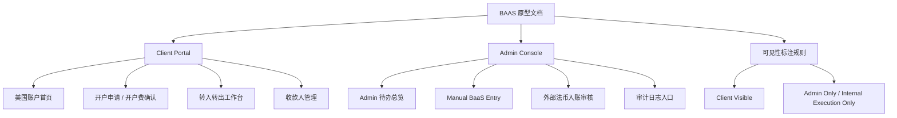

# BAAS 相关需求原型图

版本：Prototype Draft  
更新日期：2026-05-28  
适用范围：Client Portal、Admin Console、BAAS / Interlace 半自动执行流程  
入口位置：PRD 集合页的「美国账户原型」大类

## 一、文档定位

这份文档作为 BAAS 相关需求的独立原型分类，用来承载页面结构、交互流程、字段可见性和人工执行节点。它不替代主 PRD，而是把主 PRD 中的 BAAS 业务拆成可评审的线框画面。

核心目标：

- 明确客户前台能看到什么，不能看到什么。
- 明确 Admin 后台在哪些节点人工复核、手动录入、上传回单。
- 把开户、转入、转出、入账审核、收款人管理和审计追踪拆成页面原型。
- 为后续 UI 设计、开发拆分和验收提供统一画面参考。

## 二、原型信息架构



## 三、客户前台原型

### 3.1 美国账户首页

页面目的：让客户查看美国账户状态、可用余额、处理中金额和最近业务指令。

客户可见字段：

- `client_available_balance`
- `pending_incoming_balance`
- `processing_outgoing_balance`
- 已复核后的银行账户信息
- 最近订单状态

客户不可见字段：

- `interlace_actual_balance`
- `raw_response`
- BaaS USDT address
- OTC cost / Fidere margin

```text
+----------------------------------------------------------+
| US Account Overview                                      |
+-------------------+-------------------+------------------+
| Available Balance | Pending Incoming  | Processing Out   |
| USD 98,500.00     | USD 20,000.00     | USD 10,080.00    |
+-------------------+-------------------+------------------+
| US Account Info                     | Hidden From Client |
| Holder / Bank / Routing / ****4321  | actual balance     |
| Status: Completed                   | raw response       |
+-------------------------------------+--------------------+
| Recent Activity                                           |
| External fiat incoming / USD 20,000 / Under Review        |
| Transfer out / USD 10,080 / Processing                    |
+----------------------------------------------------------+
```

### 3.2 开户申请

页面目的：客户确认 USD 500 开户费并提交美国账户申请。提交后进入 Admin 手动开户流程。

关键状态：

- Opening Fee Pending
- Application Submitted
- Processing
- Account Ready for Review
- Completed
- Rejected

```text
+----------------------------------------------------------+
| Open US Account                                          |
+----------------------------------------------------------+
| Step: Fee Notice -> Confirm -> Admin Opening -> Completed|
+------------------------------+---------------------------+
| Opening Fee                  | Review Before Submit      |
| USD 500.00                   | Client / Account Type     |
| [Confirm and Submit]         | Payment Status            |
| [Save Draft]                 | Client Visible Status     |
+------------------------------+---------------------------+
```

## 四、转入转出原型

### 4.1 转入转出工作台

页面目的：统一承载 Trust Account 转入、外部法币入账查看、美国账户转出和订单进度。

建议 Tabs：

- Transfer In
- Transfer Out
- Incoming Deposits

```text
+----------------------------------------------------------+
| Transfers                                                |
+---------------+---------------+--------------------------+
| Transfer In   | Transfer Out  | Incoming Deposits        |
+---------------+---------------+--------------------------+
| New Transfer Out             | Order Timeline            |
| From: US Account             | Submitted                 |
| Beneficiary                  | Balance Frozen            |
| Amount                       | Admin Review              |
| Fidere Fee                   | Manual BaaS Entry         |
| [Submit Transfer]            | Completed                 |
+------------------------------+---------------------------+
```

### 4.2 收款人管理

页面目的：客户维护 Fidere Beneficiary。BaaS Payee ID 不展示给客户。

```text
+----------------------------------------------------------+
| Beneficiaries                                  [Add]      |
+----------------------------------------------------------+
| Example Beneficiary       ACH / Chase       Ready        |
| Vendor Operating Account  Wire / BOA        Need Review  |
| Family Trust Account      ACH / Citi        Ready        |
+----------------------------------------------------------+
```

## 五、Admin 后台原型

### 5.1 Admin 待办总览

页面目的：把开户、转账、入账、异常和对账任务集中在一个队列中。

核心筛选：

- 业务类型
- 状态
- 金额
- 客户
- SLA
- 异常标记

```text
+----------------------------------------------------------+
| Admin Work Queue                                         |
+----------+----------------+----------------+-------------+
| Opening  | Transfer Review| Incoming Review| Exceptions  |
| 12       | 8              | 5              | 3           |
+----------+----------------+----------------+-------------+
| Task                       | Client | Status           | SLA|
| Bind Interlace accountId   | A      | Binding Required | 2h |
| Review transfer out        | B      | Admin Review     | 1h |
| Match incoming deposit     | C      | Under Review     | 4h |
+----------------------------------------------------------+
```

### 5.2 Manual BaaS Entry

页面目的：Admin 在订单详情页完成客户指令核对、底层余额确认、BaaS 手动录入、reference 回填、回单上传和审计。

Admin only 字段：

- Interlace actual balance
- Interlace fee
- BaaS Payee ID
- BaaS Payout ID
- raw response
- margin

```text
+----------------------------------------------------------+
| Manual BaaS Entry                                        |
+------------------------------+---------------------------+
| Client Instruction           | Admin Only Execution Data |
| Principal                    | Interlace Actual Balance  |
| Fidere Fee                   | Interlace Fee             |
| Total Deduction              | BaaS Payee ID             |
| Beneficiary                  | BaaS Payout ID            |
+------------------------------+---------------------------+
| 1 Review -> 2 Enter BaaS -> 3 Upload Receipt -> Complete |
+----------------------------------------------------------+
```

### 5.3 外部法币入账审核

页面目的：外部法币入账先展示 Under Review，Admin 匹配客户、审核付款来源和用途，确认后才进入客户可用余额。

```text
+----------------------------------------------------------+
| Incoming Fiat Review                                     |
+------------------------------+---------------------------+
| Detected Deposit             | Match and Review          |
| Interlace Txn ID             | Matched Client            |
| Amount                       | US Account                |
| Payer                        | Client Status: Review     |
| Raw Response                 | [Approve and Post]        |
+------------------------------+---------------------------+
| Balance Impact: pending_incoming - / available + / audit |
+----------------------------------------------------------+
```

## 六、字段可见性规则

| 字段 | 可见范围 | 原型标注 |
| --- | --- | --- |
| `client_available_balance` | Client + Admin | 客户可见余额 |
| `pending_incoming_balance` | Client + Admin | 入账审核中金额 |
| `processing_outgoing_balance` | Client + Admin | 转出处理中金额 |
| `interlace_actual_balance` | Admin only | 底层真实余额 |
| BaaS Payee / Payout ID | Admin only | 手动执行字段 |
| USDT funding / tx hash | Admin only | 内部执行记录 |
| OTC cost / margin | Admin only | 成本与利润字段 |
| `receipt_url` | Client + Admin | 完成后可见，需脱敏 |
| `raw_response` | Admin only | 调试、对账和审计使用 |

## 七、验收关注点

- 客户前台不得出现 Interlace actual balance、BaaS raw response、USDT、OTC cost、margin。
- 客户只通过 Fidere Beneficiary 发起转出，不直接选择或维护 BaaS Payee。
- Admin 关键动作必须具备操作人、操作时间、动作类型和前后状态。
- 外部入账必须先 Under Review，审核通过后才更新 `client_available_balance`。
- 手动 BaaS 执行页面必须支持 reference 回填、回单上传和完成状态确认。
- 所有页面要能区分客户可见状态、后台处理状态和底层执行状态。
